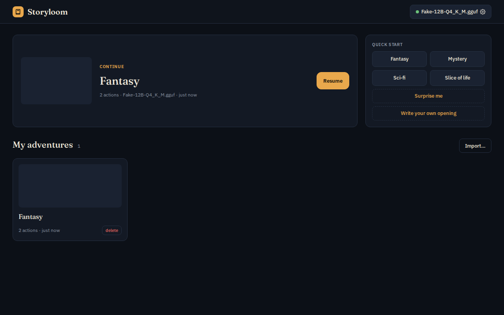
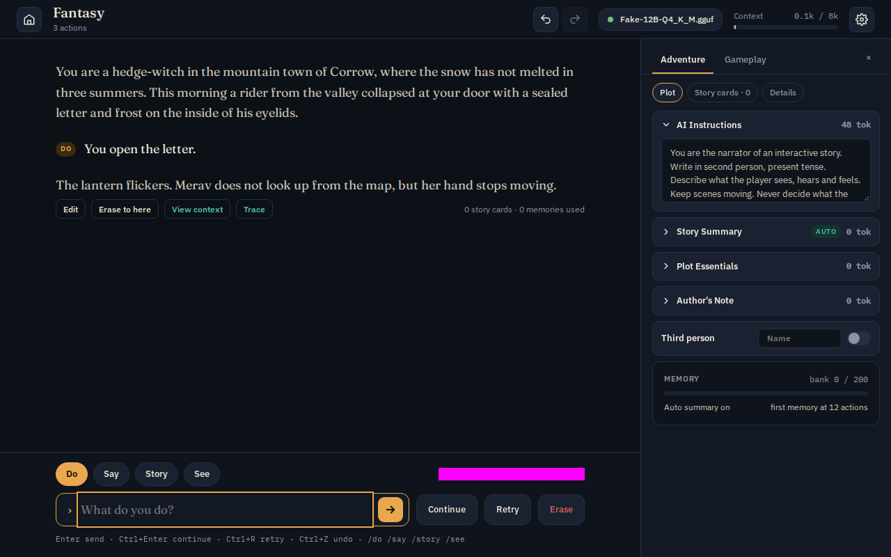

# Storyloom

An AI text adventure you run yourself, in the style of AI Dungeon. You type what you do, a
language model narrates what happens, and the world remembers: story cards, an automatic
memory bank, a story summary, author's note, scripting.

Everything runs on your own machine. The browser _is_ the game — there is no account, no
server of ours and no cloud call. The only thing you install is a local inference server
that generates the text.



## What you need

A machine that can run a 12B model, a model file, and `llama-server`
([llama.cpp](https://github.com/ggml-org/llama.cpp)). KoboldCpp, Ollama and LM Studio work
too. No GPU at all? Pick the **Demo (no GPU)** backend in Setup — canned prose, no model,
just to see the app.

The only machine the numbers below were measured on is the M2 Pro row; the rest are
estimates.

| Machine                     | Story model                   | Context                  | Speed       |
| --------------------------- | ----------------------------- | ------------------------ | ----------- |
| Mac M2 Pro 16 GB (measured) | 12B Q4_K_M                    | 16k, q8 KV (8k per slot) | ~19 tok/s   |
| 8 GB GPU                    | 12B Q4 partial offload, or 8B | 8k, q8 KV                | 15–35 tok/s |
| 16 GB GPU                   | 12B Q6, or 24B Q4             | 16k                      | 25–50 tok/s |
| 24 GB GPU                   | 24–31B Q4–Q5                  | 32k, q8 KV               | 30–50 tok/s |
| 2×24 GB, or a 64 GB+ Mac    | 70B Q4                        | 16–32k                   | 8–20 tok/s  |
| CPU only, DDR5              | 12B Q4                        | 8k                       | 3–6 tok/s   |

Below ~15 tok/s the story arrives slower than you read it.

## 1. Download a model

Wayfarer-2-12B is the model Storyloom is tuned and tested against — an adventure model with
consequences, and 7 GB on disk:

```bash
hf download LatitudeGames/Wayfarer-2-12B-GGUF Wayfarer-2-12B-Q4_K_M.gguf --local-dir ~/models
```

Other good choices: **Muse-12B** (characters and relationships), **Harbinger-24B** or
**Hearthfire-24B** if you have 24 GB, **Equinox-31B**, **Nova-70B**. All of them are under
`LatitudeGames` on Hugging Face and all use the ChatML template except the Llama-3 based
70Bs. Models carry their own licences — check the card.

## 2. Start the server

```bash
llama-server -m ~/models/Wayfarer-2-12B-Q4_K_M.gguf \
  -c 16384 -np 2 -ctk q8_0 -ctv q8_0 -ngl 99 -fa on \
  --port 8080 --path ./dist
```

Those flags are the measured recommendation for a 12B on a 16 GB Mac: `-np 2` gives the
story one slot and background jobs (memories, summaries, retry prefetch) a second one, and
`-ctk/-ctv q8_0` halves the KV cache, which is what buys 8192 tokens per slot next to 7 GB
of weights. On a bigger machine raise `-c` (it is split across the slots, so `-c 16384 -np 2`
means 8k of context per slot).

`--path ./dist` serves Storyloom itself from the same server. That is the recommended way to
run it: same origin, no browser permission prompts, works offline.

## 3. Open the app

Download `storyloom-dist.zip` from
[Releases](https://github.com/a-matson/storyloom/releases/latest), unzip it next to your
model, and point `--path` at the folder:

```bash
unzip storyloom-dist.zip -d dist
```

Then open <http://localhost:8080>. First run lands on Setup: pick **llama-server**, leave the
URL at `http://localhost:8080`, press **Test connection**. You should see the model name and
a row of capability chips. Save, and the library offers quick starts — Fantasy, Mystery,
Sci-fi, Slice of life, Surprise me, or your own opening.



Type in the box, choose **Do** / **Say** / **Story** / **See**, press Enter. `Ctrl+Enter`
continues without input, `Ctrl+R` retries, `Ctrl+Z` undoes. The sidebar (`Ctrl+.`) holds the
plot components, story cards and settings; **View context** shows exactly what was sent to
the model.

Install it from the address bar or the **Install** button; the app then opens offline
(stories are local; turns still need the server).

**The hosted demo**, <https://a-matson.github.io/storyloom/>, is the same app without the
download, and it still talks to _your_ local server — nothing is sent anywhere else. Chrome
will ask for permission the first time a public page reaches a server on your machine; allow
it. If your server refuses the request, see CORS below. For real play, prefer `--path ./dist`.

## Optional extras

**Pictures.** The **See** action generates an image of the scene if an image server is
configured. KoboldCpp serves the Stable Diffusion API; any SD 1.5 checkpoint works:

```bash
koboldcpp --nomodel --sdmodel ~/models/dreamshaper_8.safetensors --port 5001
```

Then Setup → **Image server** → `http://localhost:5001`. 512×512 is the default; covers for
your adventures can be generated or uploaded the same way.

A checkpoint's model page usually names a sampler, a clip skip and a "denoise". Copy them into
Gameplay → Images (or pick an **Apply preset**): Sampler and Clip skip go to the server as they
are, and **Hires pass** is the denoise: the picture is rendered, upscaled and redrawn at that
strength, which roughly doubles the time. Portraits never use it. **Save as preset** keeps
those settings under a name for every adventure.

**Read aloud.** Setup → Appearance → **Read aloud** speaks each new passage with a system
voice (the browser's own speech engine, nothing is downloaded). Every passage also has a
**Speak** button.

**Semantic memory.** Memory retrieval uses embeddings when a model is present, and a keyword
hash otherwise. Storyloom never downloads one: put the files of
[Xenova/bge-small-en-v1.5](https://huggingface.co/Xenova/bge-small-en-v1.5) — `config.json`,
`tokenizer.json`, `tokenizer_config.json`, `special_tokens_map.json`,
`onnx/model_quantized.onnx` — in `public/models/bge-small-en-v1.5/` before building.

**A second, smaller model** for memories, summaries and card generation (Setup → **Utility
model**) is possible but **not recommended on a single 16 GB machine**: a measured run with
Qwen2.5-3B beside the 12B made helper calls ~3× faster but pushed typical story latency from
0.8 s to ~1.4 s, and its summaries and memories were worse. Worth it only when the utility
model has its own hardware.

## Troubleshooting

**"Context 0.1k / 8k" looks too small.** That is the per-slot context: `-c` divided by `-np`.
Raise `-c` if you have the memory.

**The deployed app cannot reach the server** (`failed to fetch`, a CORS error in the
console). llama-server and KoboldCpp allow any origin by default. Ollama does not — start it
with `OLLAMA_ORIGINS=*`. Running Storyloom from `--path ./dist` avoids the problem entirely.

**A turn is suddenly slow.** Background memory work shares the GPU; generation can drop to a
third of its usual speed while a memory or summary job runs. The sidebar's Memory card shows
when one is due.

**The first turn after a long gap is slow, later ones are instant.** That is the prompt
cache. Storyloom lays the context out cache-stably so most of the prompt survives between
turns; a turn that evicts the cache costs one full prefill.

**Output stops mid-sentence or repeats itself.** Gameplay → Story generator → **Apply
preset** sets the community sampler settings for your model.

## Developing

Node ≥ 22.18, pnpm only.

```bash
pnpm install
pnpm dev      # http://localhost:5173, hot reload
pnpm check    # typecheck, lint, unit tests — green before every commit
pnpm build    # dist/
pnpm e2e      # Playwright
```

`pnpm fake-backend` starts a fake llama-server on :8080 that streams canned prose, if you
want to work on the UI without a model. The app is Vite + React + TypeScript; `src/core` is
pure, dependency-free TypeScript (context builder, memory, story cards, templates,
tokenizer), `src/adapters` talks to servers and IndexedDB, `src/app` holds the session
stores and `src/ui` the screens.

## Licence

MIT for this code. Models carry their own licences (Llama community licence, Gemma terms,
Apache-2.0 for Mistral bases); check each Hugging Face card.
